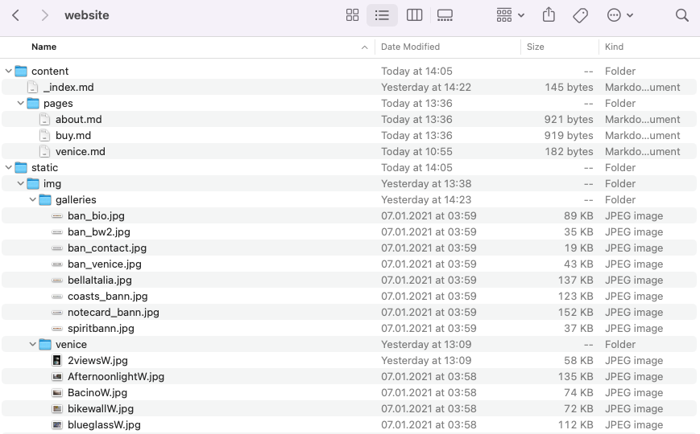

# My mother's photo gallery

Here's how you can edit it.

## Get the website and unzip it

- Ask your son for the website zip file.
- Unzip it.
- Afterwards you should see this:

## How to add a new gallery

1. Copy the /content/pages/venice.md page and rename it /content/pages/new-page.md
1. "new page" should be named like "sierras" or whatever your gallery is called.
1. Make sure the '.md' stays at the end of the file name.
1. Edit the text of the page and change the title, url, and description at the top.
1. Don't mess with the parts of the page you don't understand :)
1. Create an image you like that represents the gallery (for the home page)
1. Put this image in /static/img/galleries
1. Edit /content/_index.md to reference the image - follow the examples that are there.
1. Create a new directory for all your images in /static/img/
1. Name the new directory "sierras" or whatever you want.
1. Make sure the name of the directory matches the url back in the new page .md
1. Zip the website directory again.
1. Send it to your son :)